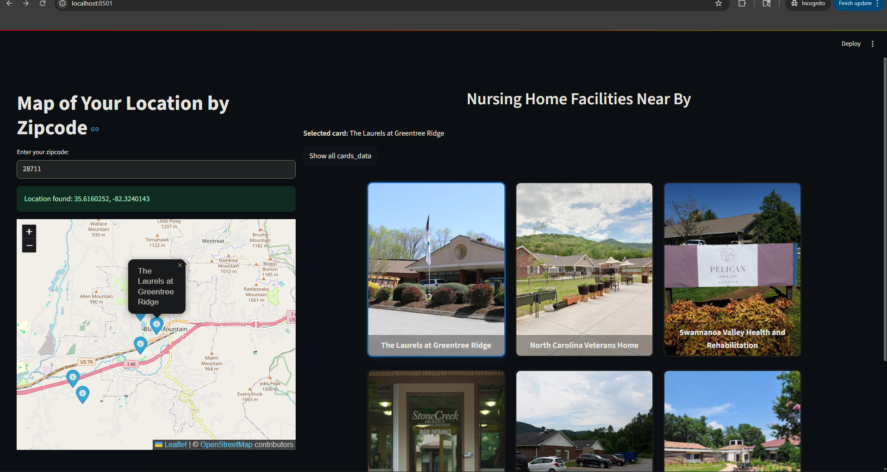

# davidapp



This is the kellcare app project by david.

## Features
- Interactive map and card grid for nursing home facilities
- Click map pins to highlight cards
- Click cards to open a modal with more details
- Card hover shows extra ratings and features

## Getting Started
1. Clone the repository
2. Install requirements (see `requirements.txt` if present)
3. Run the app:
   ```
   streamlit run main.py
   ```

## Project Structure
- `main.py` - Main Streamlit app
- `ndsj.png` - Project image (shown above)

---

For more information, see the code in `main.py`.
